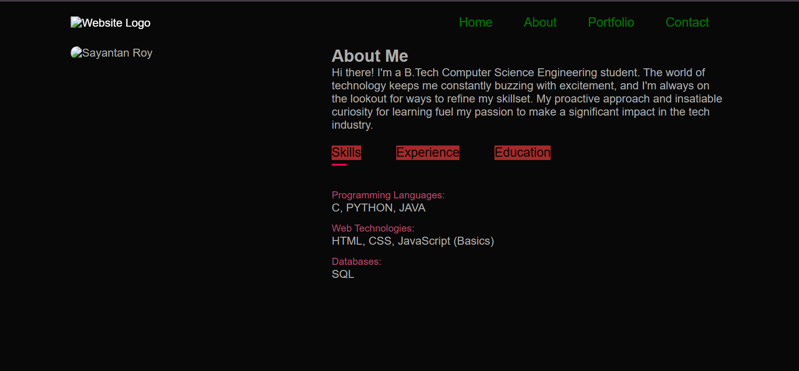
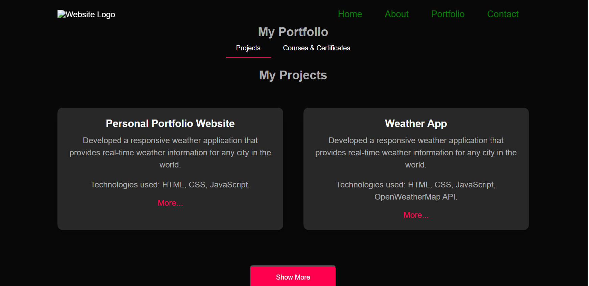

Portfolio Website
================

**About Me**
-----------

I'm Sayantan Roy, a B.Tech Computer Science Engineering student from Kolkata. I'm passionate about technology and always looking for ways to refine my skillset.

**Features**
--------

* Responsive design that adapts to different screen sizes
* Navigation menu with smooth scrolling
* About section with a photo, bio, and tabs for skills, experience, and education
* Portfolio section with a list of projects and courses/certificates
* Contact section with contact information, social media links, a download CV button, and a contact form

**Technologies**
------------

* HTML5
* CSS3
* JavaScript
* Font Awesome

**How to Run the Project**
----------------------

1. Clone the repository: `git clone https://github.com/roysayantan/portfolio-website.git`
2. Navigate to the project directory: `cd portfolio-website`
3. Open the `index.html` file in your web browser.

**Screenshots**
-------------

### About Section

<kbd></kbd>

### Portfolio Section

<kbd></kbd>

**Acknowledgments**
---------------

* [Font Awesome](https://fontawesome.com/) for the icons
* [Google Fonts](https://fonts.google.com/) for the fonts

